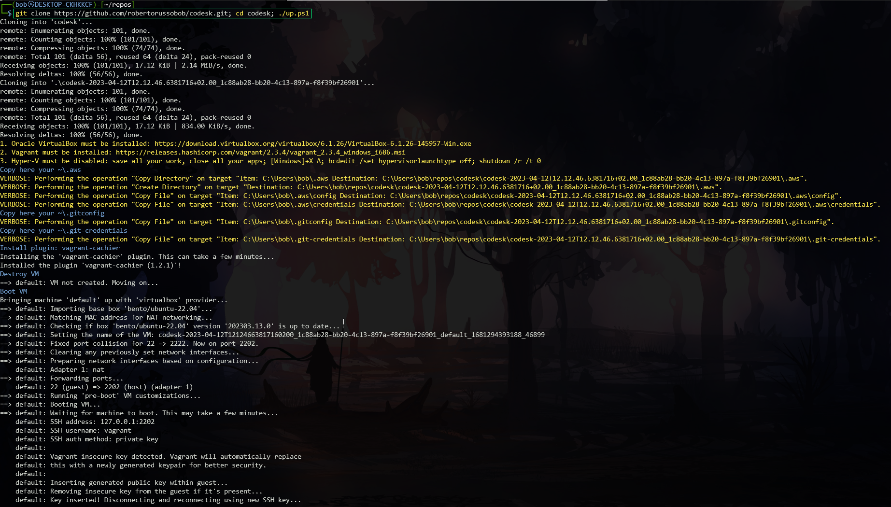
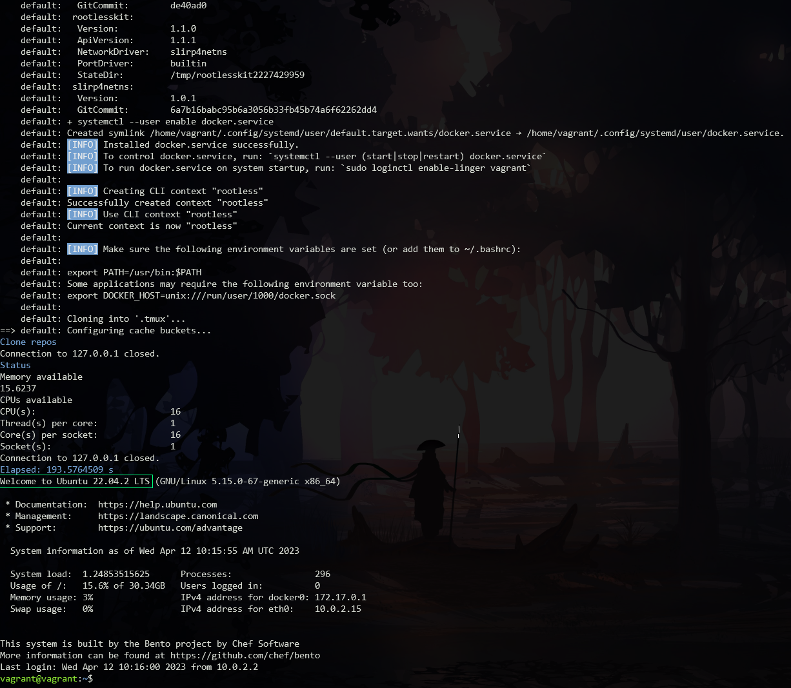

# codesk

codesk is a _development environment_ that can be packaged as a _virtual machine_ or Docker _container_; it is based on **Ubuntu Server 22.04 LTS Jammy Jellyfish** and managed by means of **Vagrant**, packed with some handy development software. 


## Additional software installed

- Docker Engine (rootless);
- AWS cli;
- GNU Parallel;
- Python 3.11


Ubuntu Server 22.04 LTS specs:
- Kernel 5.15;
- 2022-04-21 Release;
- 2027-04-21 Support;
- 2032-04-21 Security support.

## Requisites

- Oracle [VirtualBox](https://www.virtualbox.org);
- HashiCorp [Vagrant](https://www.vagrantup.com).

## Get started

Open a PowerShell and execute the following command:
```bash
$ git clone https://github.com/robertorussobob/codesk.git; cd codesk; ./up.ps1
```

You will see the VM building that starts:



than you will see the VM building that ends and lands you at the Ubuntu shell prompt:



That's all.

