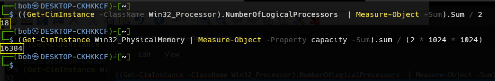
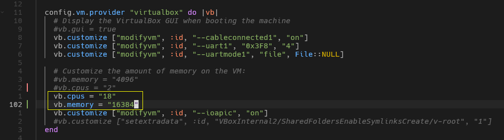
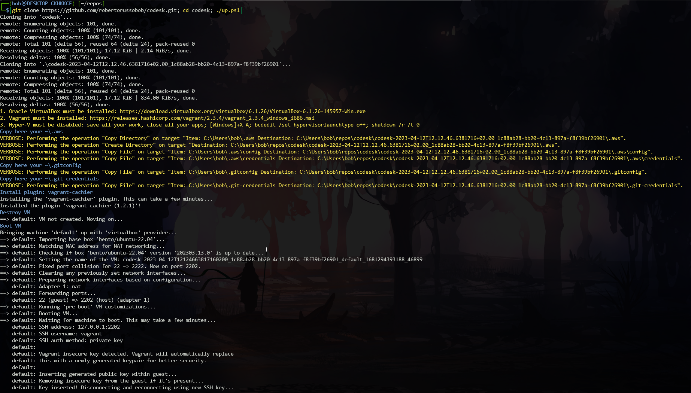
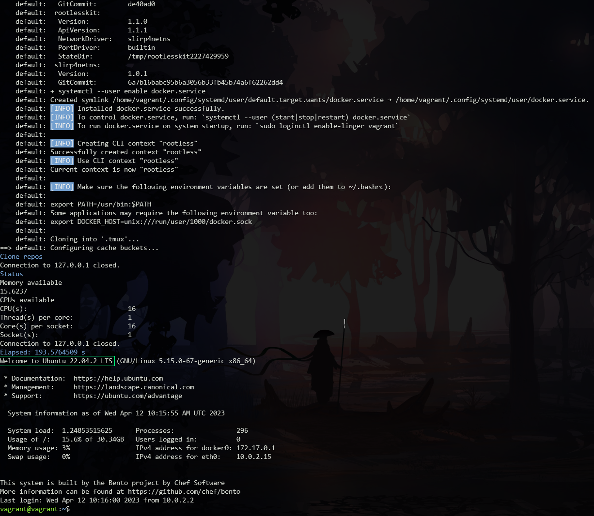

# codesk

codesk is a Linux _development environment_ aimed at Windows users.
It can be packaged as a _virtual machine_ or Docker _container_; it is based on **Ubuntu Server 22.04 LTS Jammy Jellyfish** and managed by means of **Vagrant** and packed with some handy development software. 


## Additional software installed

- Docker Engine (rootless);
- AWS cli;
- AWS sam;
- AWS CDK (Cloud Development Kit)
- GNU Parallel;
- Python 3.11
- tmux, ranger
- Terraform


Ubuntu Server 22.04 LTS specs:
- Kernel 5.15;
- 2022-04-21 Release;
- 2027-04-21 Support;
- 2032-04-21 Security support.

## Requisites

- Oracle [VirtualBox](https://www.virtualbox.org);
- HashiCorp [Vagrant](https://www.vagrantup.com).

### Install Requisites

1. Install [VirtualBox 6.1.26](https://www.virtualbox.org/wiki/Download_Old_Builds_6_1) (later versions have a bug that doesn't play well with Vagrant) [[direct download link](https://download.virtualbox.org/virtualbox/6.1.26/VirtualBox-6.1.26-145957-Win.exe)];
2. install [HashiCorp Vagrant](https://developer.hashicorp.com/vagrant/install);
3. open Windows Terminal: ⊞ Windows key + X, and then select Windows Terminal;
4. execute ((Get-CimInstance –ClassName Win32_Processor).NumberOfLogicalProcessors | Measure-Object -Sum).Sum / 2
5. execute (Get-CimInstance Win32_PhysicalMemory | Measure-Object -Property capacity -Sum).sum / (2 * 1024 * 1024)

6. write the two numbers into Vagrantfile and save the file;


## Get started

Open a PowerShell and execute the following command:
```bash
$ git clone https://github.com/robertorussobob/codesk.git; cd codesk; .\up.ps1
```

You will see the VM building that starts:



than you will see the VM building that ends and lands you at the Ubuntu shell prompt:



That's all.

